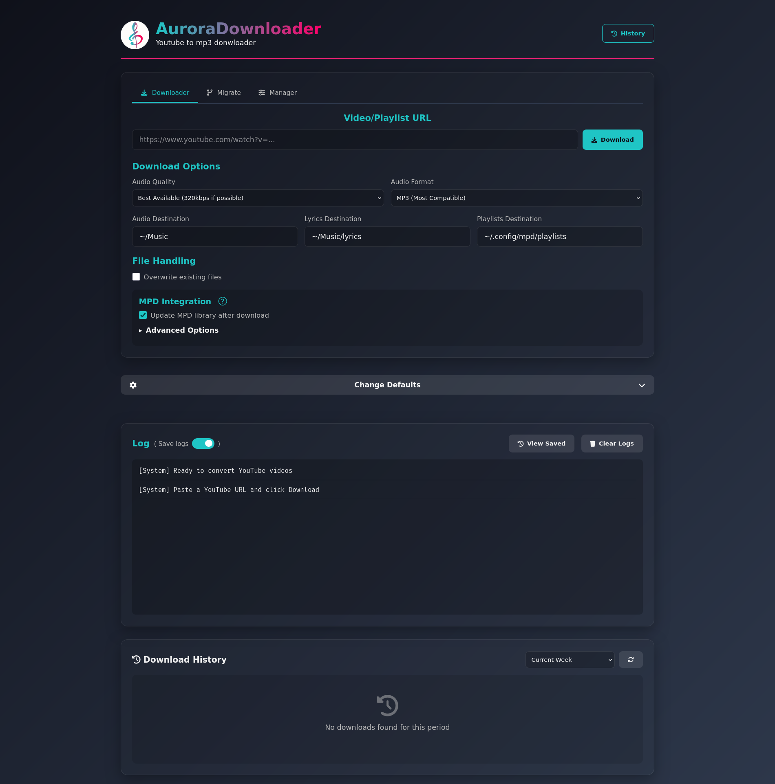

<div align="center">
  
</div>

# AuroraDownloader

**AuroraDownloader** is a lightweight, self‑hosted web application that was made by ME a music lover for music lovers such.
Aurora lets you download audio from YouTube (videos or playlists) and save it in a variety of high‑quality formats. It was originally
built for Linux and this particular version only runs reliably on Linux hosts. If you need a
Windows build, please grab the `.msi` installer from the [releases page](https://github.com/Bacem-Abidi/AuroraDownloader/releases).

> 🔒 **Important:** the command‑line utilities `yt-dlp` **and** `ffmpeg` must be installed and
> available on your `PATH`. They are not bundled with the application.



## 🎧 Features

- Convert YouTube videos or playlists to MP3, AAC, FLAC, Opus, WAV and other audio formats
- Smart metadata extraction (title, artist, album, year, etc.) and embedding
- Automatic album art handling with support for file upload or URL
- Download synchronized lyrics (LRC) when available via the YouTube Music API
- Playlist support with progress tracking and bulk retry of failed items
- Download history and detailed logs per operation
- Optional MPD integration to keep a local music server up to date
- Responsive, mobile‑friendly web interface built with Flask and Bootstrap
- Filename sanitisation suitable for all languages and file systems

## 💻 Installation (required for this version)

1. **Install prerequisites**
   - Python 3.8 or newer
   - `yt-dlp` (install via your package manager or `pip install yt-dlp`)
   - `ffmpeg` (system package; ensure `ffmpeg` is on `PATH`)

2. **Clone the repository**

   ```bash
   git clone https://github.com/Bacem-Abidi/AuroraDownloader.git
   cd AuroraDownloader
   ```

3. **Install Python dependencies**

   ```bash
   pip install -r requirements.txt
   ```

4. **Run the application**

   ```bash
   flask --app app run
   ```

5. Open your browser and navigate to `http://127.0.0.1:5000/` to use the web interface.

## ⚠️ Notes

- This repository version works best for **Linux**. Windows users should download a pre‑built
  installer from the [GitHub releases](https://github.com/Bacem-Abidi/AuroraDownloader/releases).
- Lyrics are retrieved via `ytmusicapi`, an unofficial YouTube Music API. If a track has no
  lyrics on YouTube Music, none will be downloaded.
- Make sure `yt-dlp` and `ffmpeg` are up‑to‑date to avoid compatibility issues.

---

Happy downloading! 🎶
