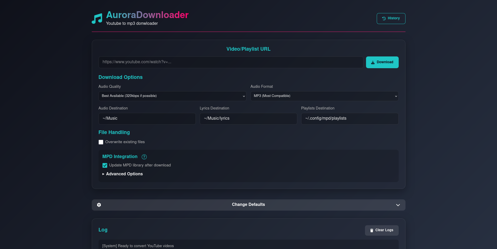

# AuroraDownloader - YouTube to MP3 Downloader

AuroraDownloader is a powerful, feature-rich YouTube to MP3 downloader with a modern web interface



---

## 🎧 Features

- **High-Quality Audio Downloads:** Convert YouTube videos to MP3, AAC, FLAC, Opus, or WAV formats
- **Smart Metadata Handling:** Automatic title, artist, album, and year extraction
- **Lyrics Integration:** Download synchronized lyrics in LRC format
- **Playlist Support:** Download entire YouTube playlists with one click
- **Cover Art Embedding:** Automatically add album art to your audio files
- **Download History:** Track all your downloads with timestamps and details
- **Format Selection:** Choose from various audio qualities (128kbps to 320kbps)
- **MPD Integration:** Automatically updates MPD library (for use with local music players like rmpc)
- **Modern Web Interface:** Beautiful and responsive UI for all devices
- **File Sanitization:** Safe filenames for all languages and characters

---

## 🚀 Getting Started

### Prerequisites

- Python 3.8+
- FFmpeg

### Installation

```bash
# Clone the repository
git clone https://github.com/Bacem-Abidi/AuroraDownloader.git

# Navigate to project directory
cd AuroraDownloader

# Download Dependencies
pip install -r requirements.txt

# Run the app
flask --app app run
```

Access the web interface at: http://127.0.0.1:5000/

---

## ⚠️ Note on Lyrics

AuroraDownloader uses ytmusicapi (_an unofficial YouTube Music API_) to fetch synchronized lyrics.  
➡️ Please check on YouTube Music whether the song you’re downloading actually has lyrics available.  
If no lyrics exist for that track, none will be downloaded.

---
